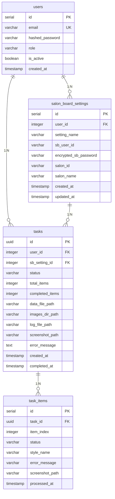

# **SALON BOARDスタイル自動投稿Webアプリケーション データベース設計書**

## **1. 概要**

本ドキュメントは、SALON BOARDスタイル自動投稿Webアプリケーションで使用するデータベースの詳細設計を定義する。

### **1.1. 基本情報**

- **DBMS**: PostgreSQL 16.x
- **文字エンコーディング**: UTF-8
- **タイムゾーン**: UTC
- **命名規則**: スネークケース（例: `user_id`, `created_at`）

### **1.2. 設計方針**

1. **正規化**: 第三正規形（3NF）を基本とする
2. **インデックス**: パフォーマンスを考慮し、適切にインデックスを設定
3. **外部キー制約**: データ整合性を保証するため、外部キー制約を設定
4. **タイムスタンプ**: 全テーブルに `created_at`、必要に応じて `updated_at` を設定
5. **論理削除**: ユーザーアカウントは物理削除せず、`is_active` フラグで管理

---

## **2. ER図**



---

## **3. テーブル定義**

### **3.1. `users` テーブル**

**説明**: ユーザーアカウント情報を管理する。

| カラム名 | データ型 | 制約 | デフォルト値 | 説明 |
|---------|---------|------|------------|------|
| `id` | SERIAL | PRIMARY KEY | - | ユーザーID（自動採番） |
| `email` | VARCHAR(255) | NOT NULL, UNIQUE | - | ログイン用メールアドレス |
| `hashed_password` | VARCHAR(255) | NOT NULL | - | bcryptでハッシュ化されたパスワード |
| `role` | VARCHAR(50) | NOT NULL | `'user'` | ユーザーロール（`admin` または `user`） |
| `is_active` | BOOLEAN | NOT NULL | `TRUE` | アカウントの有効/無効フラグ |
| `created_at` | TIMESTAMP | NOT NULL | `CURRENT_TIMESTAMP` | 作成日時 |

**インデックス**:
- `PRIMARY KEY (id)`
- `UNIQUE INDEX idx_users_email ON users(email)`
- `INDEX idx_users_role ON users(role)`
- `INDEX idx_users_is_active ON users(is_active)`

**DDL**:

```sql
CREATE TABLE users (
    id SERIAL PRIMARY KEY,
    email VARCHAR(255) NOT NULL UNIQUE,
    hashed_password VARCHAR(255) NOT NULL,
    role VARCHAR(50) NOT NULL DEFAULT 'user',
    is_active BOOLEAN NOT NULL DEFAULT TRUE,
    created_at TIMESTAMP NOT NULL DEFAULT CURRENT_TIMESTAMP,
    CONSTRAINT chk_users_role CHECK (role IN ('admin', 'user'))
);

CREATE INDEX idx_users_role ON users(role);
CREATE INDEX idx_users_is_active ON users(is_active);

COMMENT ON TABLE users IS 'ユーザーアカウント情報';
COMMENT ON COLUMN users.id IS 'ユーザーID（主キー）';
COMMENT ON COLUMN users.email IS 'ログイン用メールアドレス（一意）';
COMMENT ON COLUMN users.hashed_password IS 'bcryptでハッシュ化されたパスワード';
COMMENT ON COLUMN users.role IS 'ユーザーロール（admin/user）';
COMMENT ON COLUMN users.is_active IS 'アカウント有効フラグ（TRUE=有効, FALSE=無効）';
COMMENT ON COLUMN users.created_at IS 'アカウント作成日時';
```

---

### **3.2. `salon_board_settings` テーブル**

**説明**: ユーザーごとのSALON BOARD接続情報を管理する。

| カラム名 | データ型 | 制約 | デフォルト値 | 説明 |
|---------|---------|------|------------|------|
| `id` | SERIAL | PRIMARY KEY | - | 設定ID（自動採番） |
| `user_id` | INTEGER | NOT NULL, FOREIGN KEY | - | ユーザーID（`users.id`への参照） |
| `setting_name` | VARCHAR(100) | NOT NULL | - | ユーザーが識別するための設定名 |
| `sb_user_id` | VARCHAR(255) | NOT NULL | - | SALON BOARDのログインID |
| `encrypted_sb_password` | VARCHAR(512) | NOT NULL | - | AES-256で暗号化されたSALON BOARDのパスワード |
| `salon_id` | VARCHAR(100) | NULL | - | 対象サロンID（複数店舗の場合に使用） |
| `salon_name` | VARCHAR(255) | NULL | - | 対象サロン名（複数店舗の場合に使用） |
| `created_at` | TIMESTAMP | NOT NULL | `CURRENT_TIMESTAMP` | 作成日時 |
| `updated_at` | TIMESTAMP | NOT NULL | `CURRENT_TIMESTAMP` | 更新日時 |

**インデックス**:
- `PRIMARY KEY (id)`
- `INDEX idx_sb_settings_user_id ON salon_board_settings(user_id)`

**外部キー制約**:
- `FOREIGN KEY (user_id) REFERENCES users(id) ON DELETE CASCADE`

**DDL**:

```sql
CREATE TABLE salon_board_settings (
    id SERIAL PRIMARY KEY,
    user_id INTEGER NOT NULL,
    setting_name VARCHAR(100) NOT NULL,
    sb_user_id VARCHAR(255) NOT NULL,
    encrypted_sb_password VARCHAR(512) NOT NULL,
    salon_id VARCHAR(100),
    salon_name VARCHAR(255),
    created_at TIMESTAMP NOT NULL DEFAULT CURRENT_TIMESTAMP,
    updated_at TIMESTAMP NOT NULL DEFAULT CURRENT_TIMESTAMP,
    FOREIGN KEY (user_id) REFERENCES users(id) ON DELETE CASCADE
);

CREATE INDEX idx_sb_settings_user_id ON salon_board_settings(user_id);

COMMENT ON TABLE salon_board_settings IS 'ユーザーごとのSALON BOARD設定情報';
COMMENT ON COLUMN salon_board_settings.id IS '設定ID（主キー）';
COMMENT ON COLUMN salon_board_settings.user_id IS 'ユーザーID（外部キー）';
COMMENT ON COLUMN salon_board_settings.setting_name IS 'ユーザーが識別するための設定名';
COMMENT ON COLUMN salon_board_settings.sb_user_id IS 'SALON BOARDのログインID';
COMMENT ON COLUMN salon_board_settings.encrypted_sb_password IS 'AES-256で暗号化されたSALON BOARDのパスワード';
COMMENT ON COLUMN salon_board_settings.salon_id IS '対象サロンID（複数店舗時）';
COMMENT ON COLUMN salon_board_settings.salon_name IS '対象サロン名（複数店舗時）';
COMMENT ON COLUMN salon_board_settings.created_at IS '作成日時';
COMMENT ON COLUMN salon_board_settings.updated_at IS '最終更新日時';
```

---

### **3.3. `tasks` テーブル**

**説明**: スタイル自動投稿タスクの情報を管理する。

| カラム名 | データ型 | 制約 | デフォルト値 | 説明 |
|---------|---------|------|------------|------|
| `id` | UUID | PRIMARY KEY | - | タスクID（CeleryタスクIDと共通） |
| `user_id` | INTEGER | NOT NULL, FOREIGN KEY | - | タスクを作成したユーザーID |
| `sb_setting_id` | INTEGER | NOT NULL, FOREIGN KEY | - | 使用したSALON BOARD設定ID |
| `status` | VARCHAR(50) | NOT NULL | `'PENDING'` | タスクステータス |
| `total_items` | INTEGER | NOT NULL | `0` | 処理対象の総スタイル数 |
| `completed_items` | INTEGER | NOT NULL | `0` | 処理完了したスタイル数 |
| `data_file_path` | VARCHAR(512) | NULL | - | アップロードされたスタイル情報ファイルのパス |
| `images_dir_path` | VARCHAR(512) | NULL | - | アップロードされた画像ファイルのディレクトリパス |
| `log_file_path` | VARCHAR(512) | NULL | - | タスク実行ログファイルのパス |
| `screenshot_path` | VARCHAR(512) | NULL | - | エラー時のスクリーンショット画像パス |
| `error_message` | TEXT | NULL | - | エラーメッセージ（エラー時のみ） |
| `created_at` | TIMESTAMP | NOT NULL | `CURRENT_TIMESTAMP` | タスク作成日時 |
| `completed_at` | TIMESTAMP | NULL | - | タスク完了日時 |

**ステータス値**:
- `PENDING`: 待機中
- `PROCESSING`: 実行中
- `SUCCESS`: 成功
- `FAILURE`: 失敗
- `INTERRUPTED`: 中断

**インデックス**:
- `PRIMARY KEY (id)`
- `INDEX idx_tasks_user_id ON tasks(user_id)`
- `INDEX idx_tasks_status ON tasks(status)`
- `INDEX idx_tasks_created_at ON tasks(created_at DESC)`

**外部キー制約**:
- `FOREIGN KEY (user_id) REFERENCES users(id) ON DELETE CASCADE`
- `FOREIGN KEY (sb_setting_id) REFERENCES salon_board_settings(id) ON DELETE RESTRICT`

**DDL**:

```sql
CREATE TABLE tasks (
    id UUID PRIMARY KEY,
    user_id INTEGER NOT NULL,
    sb_setting_id INTEGER NOT NULL,
    status VARCHAR(50) NOT NULL DEFAULT 'PENDING',
    total_items INTEGER NOT NULL DEFAULT 0,
    completed_items INTEGER NOT NULL DEFAULT 0,
    data_file_path VARCHAR(512),
    images_dir_path VARCHAR(512),
    log_file_path VARCHAR(512),
    screenshot_path VARCHAR(512),
    error_message TEXT,
    created_at TIMESTAMP NOT NULL DEFAULT CURRENT_TIMESTAMP,
    completed_at TIMESTAMP,
    FOREIGN KEY (user_id) REFERENCES users(id) ON DELETE CASCADE,
    FOREIGN KEY (sb_setting_id) REFERENCES salon_board_settings(id) ON DELETE RESTRICT,
    CONSTRAINT chk_tasks_status CHECK (status IN ('PENDING', 'PROCESSING', 'SUCCESS', 'FAILURE', 'INTERRUPTED')),
    CONSTRAINT chk_tasks_completed_items CHECK (completed_items >= 0 AND completed_items <= total_items)
);

CREATE INDEX idx_tasks_user_id ON tasks(user_id);
CREATE INDEX idx_tasks_status ON tasks(status);
CREATE INDEX idx_tasks_created_at ON tasks(created_at DESC);

COMMENT ON TABLE tasks IS 'スタイル自動投稿タスク情報';
COMMENT ON COLUMN tasks.id IS 'タスクID（UUID、Celeryタスクと共通）';
COMMENT ON COLUMN tasks.user_id IS 'タスクを作成したユーザーID（外部キー）';
COMMENT ON COLUMN tasks.sb_setting_id IS '使用したSALON BOARD設定ID（外部キー）';
COMMENT ON COLUMN tasks.status IS 'タスクステータス（PENDING/PROCESSING/SUCCESS/FAILURE/INTERRUPTED）';
COMMENT ON COLUMN tasks.total_items IS '処理対象の総スタイル数';
COMMENT ON COLUMN tasks.completed_items IS '処理完了したスタイル数';
COMMENT ON COLUMN tasks.data_file_path IS 'アップロードされたスタイル情報ファイルのパス';
COMMENT ON COLUMN tasks.images_dir_path IS 'アップロードされた画像ファイルのディレクトリパス';
COMMENT ON COLUMN tasks.log_file_path IS 'タスク実行ログファイルのパス';
COMMENT ON COLUMN tasks.screenshot_path IS 'エラー時のスクリーンショット画像パス';
COMMENT ON COLUMN tasks.error_message IS 'エラーメッセージ（エラー時）';
COMMENT ON COLUMN tasks.created_at IS 'タスク作成日時';
COMMENT ON COLUMN tasks.completed_at IS 'タスク完了日時';
```

---

### **3.4. `task_items` テーブル**

**説明**: タスク内の個別スタイルの処理状況を管理する（詳細なトラッキング用）。

| カラム名 | データ型 | 制約 | デフォルト値 | 説明 |
|---------|---------|------|------------|------|
| `id` | SERIAL | PRIMARY KEY | - | アイテムID（自動採番） |
| `task_id` | UUID | NOT NULL, FOREIGN KEY | - | 所属するタスクID |
| `item_index` | INTEGER | NOT NULL | - | スタイルの順序（0始まり） |
| `status` | VARCHAR(50) | NOT NULL | `'PENDING'` | アイテムステータス |
| `style_name` | VARCHAR(255) | NULL | - | スタイル名 |
| `error_message` | TEXT | NULL | - | エラーメッセージ（エラー時のみ） |
| `screenshot_path` | VARCHAR(512) | NULL | - | エラー時のスクリーンショット画像パス |
| `processed_at` | TIMESTAMP | NULL | - | 処理完了日時 |

**ステータス値**:
- `PENDING`: 未処理
- `PROCESSING`: 処理中
- `SUCCESS`: 成功
- `FAILURE`: 失敗
- `SKIPPED`: スキップ

**インデックス**:
- `PRIMARY KEY (id)`
- `UNIQUE INDEX idx_task_items_task_item ON task_items(task_id, item_index)`
- `INDEX idx_task_items_status ON task_items(status)`

**外部キー制約**:
- `FOREIGN KEY (task_id) REFERENCES tasks(id) ON DELETE CASCADE`

**DDL**:

```sql
CREATE TABLE task_items (
    id SERIAL PRIMARY KEY,
    task_id UUID NOT NULL,
    item_index INTEGER NOT NULL,
    status VARCHAR(50) NOT NULL DEFAULT 'PENDING',
    style_name VARCHAR(255),
    error_message TEXT,
    screenshot_path VARCHAR(512),
    processed_at TIMESTAMP,
    FOREIGN KEY (task_id) REFERENCES tasks(id) ON DELETE CASCADE,
    CONSTRAINT chk_task_items_status CHECK (status IN ('PENDING', 'PROCESSING', 'SUCCESS', 'FAILURE', 'SKIPPED')),
    UNIQUE (task_id, item_index)
);

CREATE INDEX idx_task_items_status ON task_items(status);

COMMENT ON TABLE task_items IS 'タスク内の個別スタイル処理情報';
COMMENT ON COLUMN task_items.id IS 'アイテムID（主キー）';
COMMENT ON COLUMN task_items.task_id IS '所属するタスクID（外部キー）';
COMMENT ON COLUMN task_items.item_index IS 'スタイルの順序（0始まり）';
COMMENT ON COLUMN task_items.status IS 'アイテムステータス（PENDING/PROCESSING/SUCCESS/FAILURE/SKIPPED）';
COMMENT ON COLUMN task_items.style_name IS 'スタイル名';
COMMENT ON COLUMN task_items.error_message IS 'エラーメッセージ（エラー時）';
COMMENT ON COLUMN task_items.screenshot_path IS 'エラー時のスクリーンショット画像パス';
COMMENT ON COLUMN task_items.processed_at IS '処理完了日時';
```

---

## **4. リレーションシップ**

### **4.1. `users` ⇔ `salon_board_settings`**

- **種類**: 1対多（1:N）
- **関係**: 1人のユーザーは複数のSALON BOARD設定を持つことができる
- **外部キー**: `salon_board_settings.user_id` → `users.id`
- **削除時の動作**: `ON DELETE CASCADE` （ユーザー削除時、関連する設定も削除）

### **4.2. `users` ⇔ `tasks`**

- **種類**: 1対多（1:N）
- **関係**: 1人のユーザーは複数のタスクを作成できる
- **外部キー**: `tasks.user_id` → `users.id`
- **削除時の動作**: `ON DELETE CASCADE` （ユーザー削除時、関連するタスクも削除）

### **4.3. `salon_board_settings` ⇔ `tasks`**

- **種類**: 1対多（1:N）
- **関係**: 1つの設定は複数のタスクで使用される可能性がある
- **外部キー**: `tasks.sb_setting_id` → `salon_board_settings.id`
- **削除時の動作**: `ON DELETE RESTRICT` （設定削除時、使用中のタスクがある場合は削除不可）

### **4.4. `tasks` ⇔ `task_items`**

- **種類**: 1対多（1:N）
- **関係**: 1つのタスクは複数のアイテム（スタイル）を含む
- **外部キー**: `task_items.task_id` → `tasks.id`
- **削除時の動作**: `ON DELETE CASCADE` （タスク削除時、関連するアイテムも削除）

---

## **5. 初期データ**

### **5.1. 初回管理者アカウント**

初回デプロイ後、以下のコマンドでコマンドラインから管理者アカウントを作成する。

```bash
docker-compose exec web python create_admin.py admin@example.com SecurePassword123!
```

このスクリプトは、以下のSQLを実行する想定。

```sql
INSERT INTO users (email, hashed_password, role, is_active, created_at)
VALUES (
    'admin@example.com',
    '$2b$12$...',  -- bcryptハッシュ化されたパスワード
    'admin',
    TRUE,
    CURRENT_TIMESTAMP
);
```

---

## **6. トリガー定義**

### **6.1. `updated_at` 自動更新トリガー**

`salon_board_settings` テーブルの `updated_at` を自動更新する。

```sql
-- トリガー関数の作成
CREATE OR REPLACE FUNCTION update_updated_at_column()
RETURNS TRIGGER AS $$
BEGIN
    NEW.updated_at = CURRENT_TIMESTAMP;
    RETURN NEW;
END;
$$ LANGUAGE plpgsql;

-- トリガーの設定
CREATE TRIGGER trigger_update_sb_settings_updated_at
    BEFORE UPDATE ON salon_board_settings
    FOR EACH ROW
    EXECUTE FUNCTION update_updated_at_column();
```

---

## **7. パフォーマンス最適化**

### **7.1. インデックス戦略**

以下のクエリパターンを想定してインデックスを設定している。

1. **ユーザーのメールアドレスでログイン**: `users.email` にUNIQUE INDEX
2. **ユーザーのロール検索**: `users.role` にINDEX
3. **ユーザーのアクティブ状態検索**: `users.is_active` にINDEX
4. **ユーザーIDによる設定取得**: `salon_board_settings.user_id` にINDEX
5. **ユーザーIDによるタスク取得**: `tasks.user_id` にINDEX
6. **タスクステータスでのフィルタ**: `tasks.status` にINDEX
7. **タスク作成日時の降順ソート**: `tasks.created_at DESC` にINDEX

### **7.2. パーティショニング（将来の拡張）**

タスク数が増加した場合、`tasks` テーブルを作成日時でパーティショニングすることを検討する。

```sql
-- 例: 月次パーティショニング
CREATE TABLE tasks_2025_01 PARTITION OF tasks
    FOR VALUES FROM ('2025-01-01') TO ('2025-02-01');

CREATE TABLE tasks_2025_02 PARTITION OF tasks
    FOR VALUES FROM ('2025-02-01') TO ('2025-03-01');
```

---

## **8. バックアップ戦略**

### **8.1. 推奨バックアップ方法**

1. **論理バックアップ (pg_dump)**:
   ```bash
   docker-compose exec db pg_dump -U postgres -d salonboard_db > backup_$(date +%Y%m%d).sql
   ```

2. **物理バックアップ (pg_basebackup)**:
   ```bash
   pg_basebackup -h localhost -U postgres -D /backup/base -Fp -Xs -P
   ```

3. **定期バックアップ**: cronジョブで毎日実行
   ```bash
   0 2 * * * /path/to/backup_script.sh
   ```

### **8.2. リストア方法**

```bash
docker-compose exec -T db psql -U postgres -d salonboard_db < backup_20250118.sql
```

---

## **9. セキュリティ考慮事項**

### **9.1. 暗号化**

- **パスワード**: `users.hashed_password` は bcrypt でハッシュ化（ソルト付き）
- **SALON BOARDパスワード**: `salon_board_settings.encrypted_sb_password` は AES-256 で暗号化
- **暗号化キー**: 環境変数 `ENCRYPTION_KEY` で管理（32バイト以上）

### **9.2. アクセス制御**

- データベースユーザーは最小権限の原則に従う
- アプリケーション専用ユーザーを作成し、必要なテーブルへのアクセスのみ許可

```sql
-- アプリケーション用ユーザー作成
CREATE USER salonboard_app WITH PASSWORD 'strong_password';

-- 必要な権限のみ付与
GRANT SELECT, INSERT, UPDATE, DELETE ON ALL TABLES IN SCHEMA public TO salonboard_app;
GRANT USAGE, SELECT ON ALL SEQUENCES IN SCHEMA public TO salonboard_app;
```

---

## **10. マイグレーション管理**

データベーススキーマの変更は、Alembic（SQLAlchemy用）などのマイグレーションツールで管理する。

### **10.1. マイグレーション例**

```bash
# 新しいマイグレーションファイル生成
alembic revision --autogenerate -m "Add task_items table"

# マイグレーション適用
alembic upgrade head

# ロールバック
alembic downgrade -1
```

---

## **11. データ保持ポリシー**

### **11.1. タスクデータ**

- **完了タスク**: 90日間保持後、アーカイブまたは削除
- **ログファイル**: 30日間保持
- **スクリーンショット**: 30日間保持

### **11.2. クリーンアップSQL**

```sql
-- 90日以上前の完了タスクを削除
DELETE FROM tasks
WHERE status IN ('SUCCESS', 'FAILURE')
  AND completed_at < CURRENT_TIMESTAMP - INTERVAL '90 days';
```

定期実行はcronジョブで設定する。

---

## **12. モニタリング**

### **12.1. 監視すべきメトリクス**

1. **テーブルサイズ**: `tasks` テーブルの肥大化を監視
2. **インデックス使用率**: 未使用インデックスの検出
3. **スロークエリ**: 実行時間が長いクエリの特定
4. **接続数**: 同時接続数の監視

### **12.2. 監視クエリ例**

```sql
-- テーブルサイズ確認
SELECT
    table_name,
    pg_size_pretty(pg_total_relation_size(quote_ident(table_name))) AS size
FROM information_schema.tables
WHERE table_schema = 'public'
ORDER BY pg_total_relation_size(quote_ident(table_name)) DESC;

-- インデックス使用率確認
SELECT
    schemaname,
    tablename,
    indexname,
    idx_scan,
    idx_tup_read,
    idx_tup_fetch
FROM pg_stat_user_indexes
ORDER BY idx_scan ASC;
```

---

## **13. 付録: 完全なDDL**

完全なデータベース作成スクリプトは、プロジェクトの `database/init.sql` に配置する。

```sql
-- データベース作成
CREATE DATABASE salonboard_db
    WITH
    ENCODING = 'UTF8'
    LC_COLLATE = 'en_US.UTF-8'
    LC_CTYPE = 'en_US.UTF-8'
    TEMPLATE = template0;

\c salonboard_db;

-- UUID拡張を有効化
CREATE EXTENSION IF NOT EXISTS "uuid-ossp";

-- 上記で定義した全テーブルのCREATE文を実行
-- (省略)
```
