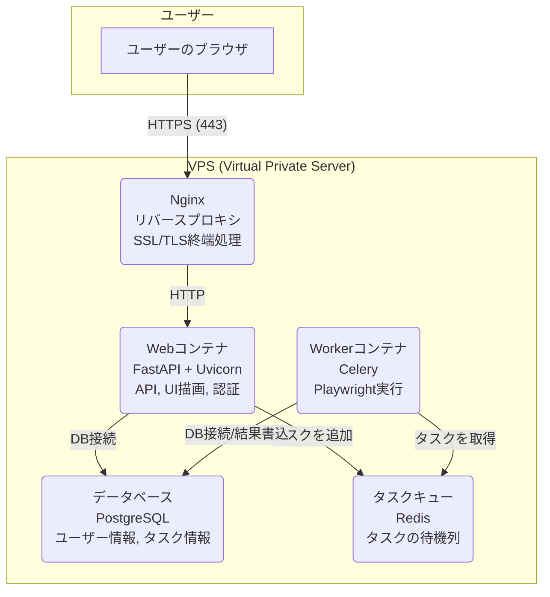

## **SALON BOARDスタイル自動投稿Webアプリケーション 基本設計書**

### **1. 目的**

本ドキュメントは、要件定義書で定められた仕様を技術的に実現するためのアーキテクチャ、データ構造、主要な処理フローを定義することを目的とする。開発者は本設計書に基づき、具体的な実装作業に着手する。

### **2. システムアーキテクチャ**

本アプリは、**Docker Compose** を用いたマイクロサービスライクなコンテナ構成を採用する。これにより、各機能の独立性を高め、開発・デプロイ・スケールを容易にする。

### **2.1. コンテナ構成図**

- **データ永続化**: PostgreSQLのデータディレクトリとログファイルは、Docker Volumeを用いてホストOS上に保存する。

### **3. 技術スタック**

| 領域 | 技術 | 選定理由 |
| --- | --- | --- |
| **バックエンド** | Python / FastAPI | 高速なAPI開発が可能で、非同期処理にも対応。Pythonエコシステム（Playwright, Pandas等）との親和性が高い。 |
| **フロントエンド** | Jinja2, HTML, CSS, JavaScript | FastAPIとの連携が容易。SSR（サーバーサイドレンダリング）により、シンプルな構成でレスポンシブUIを実現できる。 |
| **ブラウザ自動化** | Playwright for Python | 高機能かつ安定しており、モダンなWebサイトの自動化に適している。 |
| **データベース** | PostgreSQL | 信頼性と拡張性に優れたオープンソースRDBMS。構造化されたデータ管理に適している。 |
| **タスクキュー** | Celery + Redis | Pythonで標準的な非同期タスク処理ライブラリ。重いPlaywright処理をWebサーバーから完全に分離できる。Redisは高速なインメモリDBで、ブローカーとして最適。 |
| **コンテナ技術** | Docker / Docker Compose | 開発環境と本番環境の差異をなくし、デプロイを簡素化・高速化する。 |
| **Webサーバー** | Uvicorn (FastAPI用), Nginx | UvicornはFastAPIの公式ASGIサーバー。Nginxはリバースプロキシとして、セキュリティとパフォーマンス向上に貢献する。 |

### **4. データベース設計 (主要テーブル)**

### **`users` テーブル**

ユーザーのアカウント情報を格納する。

| カラム名 | データ型 | 説明 |
| --- | --- | --- |
| `id` | SERIAL | 主キー |
| `email` | VARCHAR(255) | ログインID (UNIQUE, NOT NULL) |
| `hashed_password` | VARCHAR(255) | ハッシュ化されたパスワード (NOT NULL) |
| `role` | VARCHAR(50) | ユーザーロール (`admin` or `user`) (NOT NULL) |
| `is_active` | BOOLEAN | アカウントの有効/無効フラグ (Default: TRUE) |
| `created_at` | TIMESTAMP | 作成日時 |

### **`salon_board_settings` テーブル**

ユーザーごとにSALON BOARDの接続情報を格納する。

| カラム名 | データ型 | 説明 |
| --- | --- | --- |
| `id` | SERIAL | 主キー |
| `user_id` | INTEGER | `users.id`への外部キー (NOT NULL) |
| `setting_name` | VARCHAR(100) | ユーザーが識別するための設定名 (例: A店, B店) |
| `sb_user_id` | VARCHAR(255) | SALON BOARDのログインID (NOT NULL) |
| `encrypted_sb_password` | VARCHAR(512) | **暗号化された**SALON BOARDのパスワード (NOT NULL) |
| `salon_id` | VARCHAR(100) | 対象サロンID (NULL許容) |
| `salon_name` | VARCHAR(255) | 対象サロン名 (NULL許容) |
| `created_at` | TIMESTAMP | 作成日時 |
| `updated_at` | TIMESTAMP | 更新日時 |
- **リレーション**: `users` 1 : N `salon_board_settings`

### **`tasks` テーブル**

実行された自動投稿タスクの情報を格納する。

| カラム名 | データ型 | 説明 |
| --- | --- | --- |
| `id` | UUID | 主キー (CeleryのタスクIDと共通) |
| `user_id` | INTEGER | `users.id`への外部キー (NOT NULL) |
| `status` | VARCHAR(50) | タスクの状態 (`PENDING`, `PROCESSING`, `SUCCESS`, `FAILURE`, `INTERRUPTED`) |
| `total_items` | INTEGER | 処理対象の総スタイル数 |
| `completed_items` | INTEGER | 処理完了したスタイル数 |
| `log_file_path` | VARCHAR(512) | エラーログのファイルパス (NULL許容) |
| `screenshot_path` | VARCHAR(512) | エラースクリーンショットのパス (NULL許容) |
| `created_at` | TIMESTAMP | 作成日時 |
| `completed_at` | TIMESTAMP | 完了日時 (NULL許容) |
- **リレーション**: `users` 1 : N `tasks`

### **5. API設計 (主要エンドポイント)**

| メソッド | URL | 認証 | 説明 |
| --- | --- | --- | --- |
| `POST` | `/auth/token` | 公開 | サインイン処理。成功時にJWTを返す。 |
| `GET` | `/users/me` | 要認証 | サインイン中のユーザー情報を取得する。 |
| `GET` | `/users` | 管理者のみ | ユーザー一覧を取得する。 |
| `POST` | `/users` | 管理者のみ | 新規ユーザーを作成する。 |
| `GET` | `/sb-settings` | 要認証 | 自身のSB設定一覧を取得する。 |
| `POST` | `/sb-settings` | 要認証 | 新しいSB設定を作成する。 |
| `PUT` | `/sb-settings/{id}` | 要認証 | 自身のSB設定を更新する。 |
| `DELETE` | `/sb-settings/{id}` | 要認証 | 自身のSB設定を削除する。 |
| `GET` | `/tasks` | 要認証 | 自身のタスク一覧を取得する。 |
| `POST` | `/tasks/style-post` | 要認証 | 新規スタイル投稿タスクを作成・実行する。 |
| `POST` | `/tasks/{id}/interrupt` | 要認証 | 実行中のタスクを中断する。 |
| `POST` | `/tasks/{id}/resume` | 要認証 | 中断中のタスクを再開する。 |
| `GET` | `/tasks/status` | 要認証 | （WebSocket代替）タスクの最新状況をポーリングする。 |

### **6. バックグラウンド処理フロー**

1. **タスク作成**:
    - ユーザーがUIで「実行」ボタンを押す。
    - フロントエンドは、ファイル（スタイル情報、画像）と選択されたSB設定IDを FastAPI の `/tasks/style-post` エンドポイントに `POST` する。
    - FastAPIは、ファイルを一時ディレクトリに保存し、Celeryタスク（例: `run_playwright_task`）をタスク情報と共にRedisにエンキューする。
    - FastAPIは、即座にタスクIDをフロントエンドに返す。
2. **タスク実行**:
    - Celeryワーカーは、Redisからタスクを取得する。
    - ワーカーは、DBからタスクIDとユーザーIDを基に必要な情報（SB設定など）を取得する。
    - **`SalonBoardStylePoster` クラスのインスタンスを生成し、`run()` メソッドを実行する。**
    - ワーカーは、`run()` メソッドの進捗（例: 1件完了ごと）をDBの `tasks` テーブルに随時更新する。
    - `run()` メソッドが完了したら、最終的なステータス（`SUCCESS` or `FAILURE`）、ログ/スクリーンショットのパスをDBに記録する。

### **7. セキュリティ設計**

- **認証**: サインイン時に**JWT (JSON Web Token)** を発行。以降のAPIリクエストでは、HTTPヘッダーにこのトークンを含めることでユーザーを認証する。
- **パスワードハッシュ化**: `passlib` ライブラリを使用し、`bcrypt` アルゴリズムでユーザーパスワードをハッシュ化する。
- **機密情報暗号化**: `cryptography` ライブラリを使用し、環境変数から読み込んだキーを用いてSALON BOARDのパスワードを暗号化・復号する。**暗号化処理はDBへの保存直前、復号処理はPlaywrightプロセスへの受け渡し直前**に行う。

### **8. デプロイ設計**

1. **Dockerfileの準備**:
    - `Dockerfile` を作成し、Pythonのインストール、ライブラリのインストール（`requirements.txt`）、Playwrightのブラウザインストール、アプリケーションコードのコピーを行う。
2. **docker-compose.ymlの準備**:
    - アーキテクチャ図に示した `web`, `worker`, `db`, `redis`, `nginx` の各サービスを定義する。
    - 環境変数ファイル (`.env`) を読み込む設定を追加する。
3. **環境変数ファイル (`.env`) の準備**:
    - データベース接続情報、暗号化キー、JWTのシークレットキーなど、すべての機密情報をこのファイルで管理する。**このファイルはGitリポジトリに含めない。**
4. **VPSでのデプロイ手順**:
    1. VPSにDockerとDocker Composeをインストールする。
    2. Gitリポジトリからソースコードをクローンする。
    3. サーバー上で `.env` ファイルを作成し、本番用の値を設定する。
    4. `docker-compose build` を実行して、イメージをビルドする。
    5. `docker-compose up -d` を実行して、全コンテナをバックグラウンドで起動する。
    6. `docker-compose exec web python create_admin.py ...` を実行し、初回管理者アカウントを作成する。